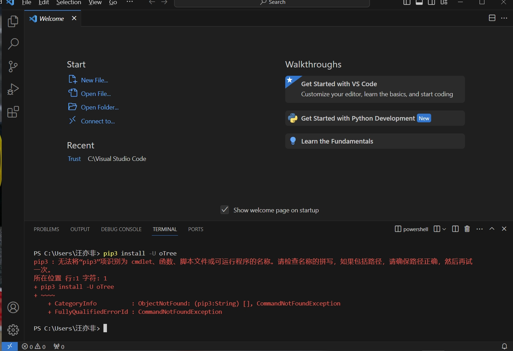
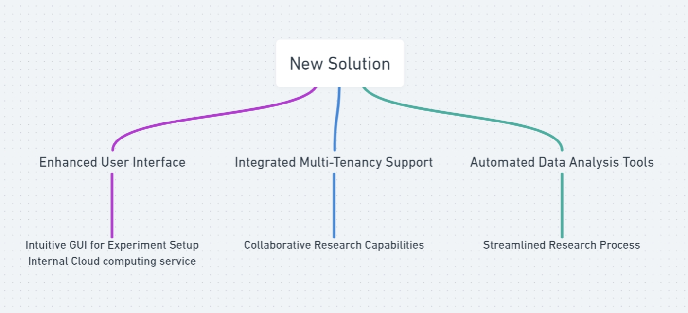
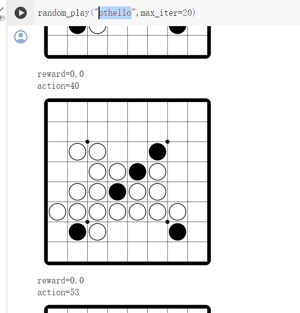
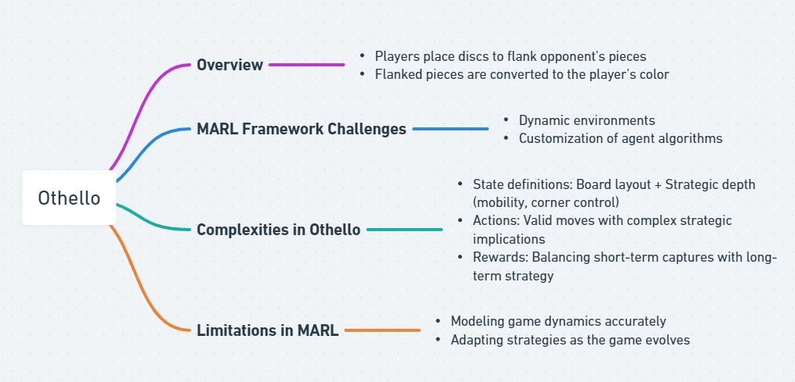
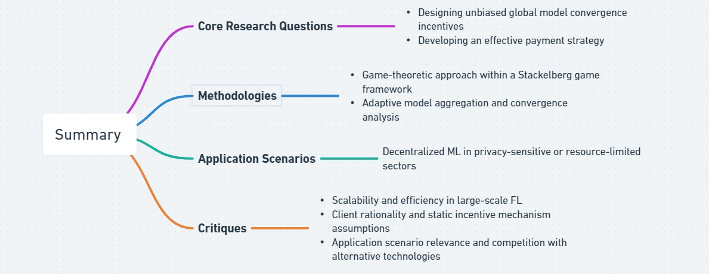
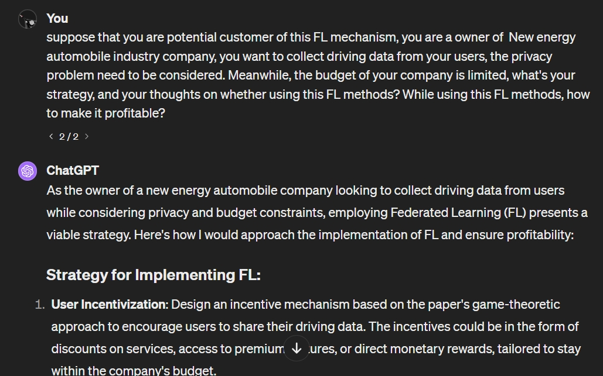
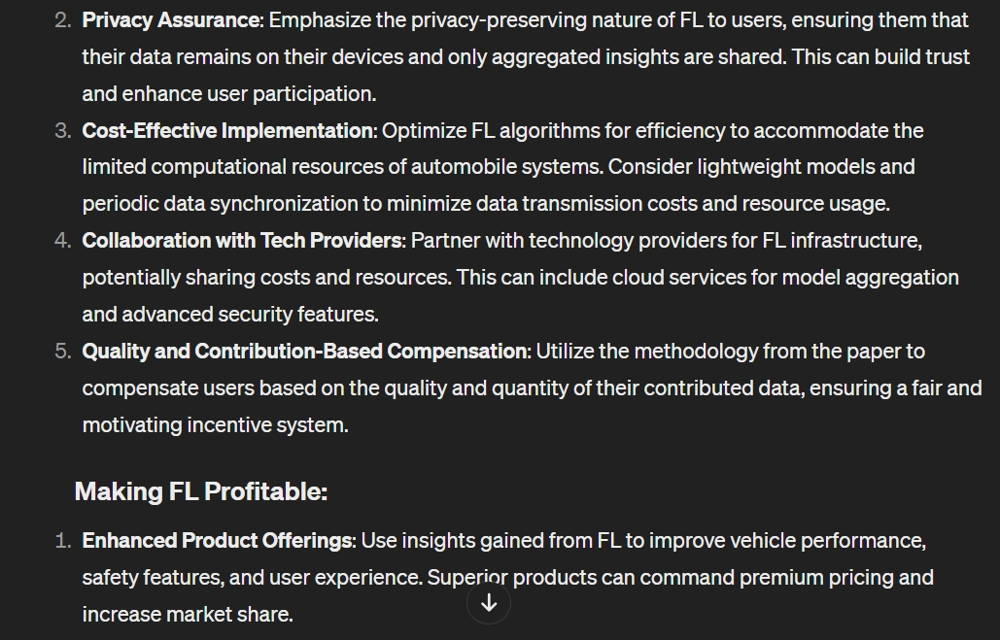
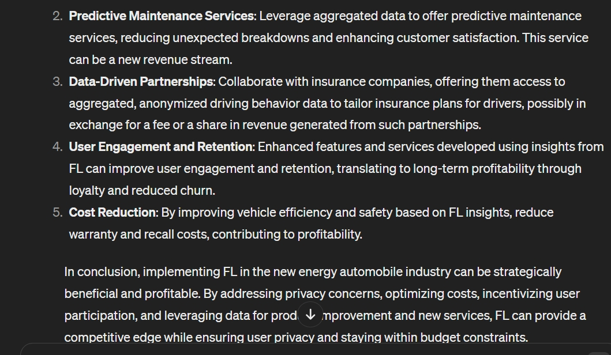

# Reflection 2

### Question 1 
**Question 1 on Beyond Computer Science and Economics Methodology 1 Behavioral Game Theory and Mechanism Design: Innovating Behavioral Game Theory Tools**: Analyze your experience with oTree, identifying pain points in behavioral game theory research. Review related literature and class discussions to understand experimental economics' goals. Propose a software solution that outperforms oTree in at least three aspects, enhancing strategic interaction studies. Highlight why these advancements are crucial. Submit a concise essay question answer (500 words max) with your analysis and proposals, backed by literature and class insights. Your innovative ideas can significantly contribute to experimental economics, addressing current limitations and paving the way for advanced research methodologies. 

### Question 2
**Question 2 Beyond Computer Science and Economics Methodology 2 Multi-agent Reinforcement Learning:  Advancing Multi-Agent Reinforcement Learning**: Delve into the limitations of current multi-agent reinforcement learning (MARL) frameworks, focusing on environment constraints and agent algorithm customizations. Choose a classic game (e.g., Prisoner's Dilemma, Battle of the Sexes, or the Trust Game) to illustrate these limitations. Describe the development process of a MARL agent for your selected game, detailing the definition of states, actions, and rewards grounded in fundamental behavioral assumptions. Your analysis should provide insights into overcoming MARL's current limitations, fostering advancements in the field. Submit a comprehensive report (500 words max) with your findings and proposals.

### Question 3
**Question 3 Brainstorm your research idea by criticizing existing research: Critiquing and Expanding upon Existing Research**: Objective: The goal of this assignment is to engage critically with existing research in the field of federated learning, using the specific paper presented by the guest speaker as a primary example. Students will assess the paper's research questions, methodologies, and application scenarios and propose new research ideas addressing the identified limitations or gaps.

Instructions:
1. Summary of the Paper
Core Research Questions: Briefly summarize the paper's primary research questions. What is the main problem or challenge the paper seeks to solve or understand?

Methodologies: Describe the methods employed in the paper to address the research questions. Consider the approaches, models, or experimental designs used.

Application Scenarios: Outline the application scenarios discussed in the paper. How does the paper propose to apply its findings or solutions in real-world contexts?

2. Critique of the Research Question
Reflect on the research questions posed in the paper. Are there other more significant objectives or questions that could be more relevant or impactful in this context? Explain why these alternative questions or objectives might offer more value or insight.

3. Critique of the Methodology
Analyze the assumptions made in the paper regarding the strategic environment and behavioral foundations. Discuss whether these assumptions are justified or if they require more reasonable treatment. Suggest how the methodology could be improved or altered to address these concerns.

4. Critique of the Application Scenario
Evaluate the relevance and currency of the federated learning scenarios presented in the paper. With the rapid advancement in technology, consider whether there are more modern or advanced application scenarios that could be more effective in solving similar issues, such as blockchain, generative AI, other privacy-preserving technologies, or quantum computing.

5. Beyond Computer Science and Economics
Consider the role of bounded rationality in both human and AI agents within the context of the paper's findings. Propose how the results might change if the study incorporated participants with specific psychological heuristics or different versions of AI, such as ChatGPT.

# Answer

### Question 1
In analyzing the use of oTree within the context of behavioral game theory research, it's essential to recognize both its strengths and its limitations. As a web-based, opensource platform, it does bring certain advantages to the research. Despite these advantages, during my experience, several pain points emerge, particularly when considering the evolving needs of experimental economics and the study of strategic interactions.

The first is the problem within the interface and management aspects. The oTree’s functions rely on user’s Python, while this could lead to system problem like unable to install oTree or version incompatibility. 

Another significant limitation is the necessity for users to delve into code for most experiment configurations. Settings such as participant groups and payoff mechanisms are primarily adjusted within Python files or the settings.py file. This can be a barrier for researchers who may prefer a more graphical user interface (GUI) for experiment setup. Additionally, while oTree does offer session configurations via a dashboard, this flexibility is contingent on prior specifications within the settings.py file, which may not be intuitive for all users (Shu Wing Chan et al. 2019).

Furthermore, oTree lacks multi-tenancy support, limiting its utility in environments where multiple experimenters might wish to conduct studies simultaneously while maintaining data isolation. This constraint can hinder collaborative research efforts or the use of oTree in larger lab settings where multiple studies are conducted in parallel.

In response to these challenges, here are some of my solutions that surpasses oTree in key areas. These proposed solutions would include:

1: Enhanced User Interface: A more intuitive GUI for experiment setup, allowing researchers to configure participant settings, groupings, and payoffs without delving into code. Meanwhile, provide internal cloud computing service, let the users to be able to bypass their own local python environment. This would lower the barrier to entry for researchers less familiar with programming, broadening the software's appeal.

2: Integrated Multi-Tenancy Support: By enabling multiple experimenters to work within the same software installation without compromising data integrity or visibility, this feature would facilitate collaborative research and make the software more suitable for larger lab environments.

3: Automated Data Analysis Tools: Incorporating built-in tools for common statistical analyses and data visualization directly within the platform could streamline the research process, from experiment design to data analysis.

*Figure 1: Problem with Otree*

*Figure 2: Flowchart For Q1*
### Question 2

In the strategic game of Othello, players alternate placing discs on a board, aiming to flank and convert their opponent's discs to their own color. This game poses significant challenges for current multi-agent reinforcement learning (MARL) frameworks due to the dynamic nature of the environment and the intricacies involved in customizing agent algorithms. Specifically, in Othello, the state definition encompasses not just the board's layout but also strategic elements like potential moves and control of key positions. Although actions—representing valid moves—are straightforward, their strategic ramifications are nuanced. The design of reward systems is also complex, requiring a delicate balance between immediate piece captures and longer-term strategic advantages. MARL's limitations stem from the difficulty in precisely modeling these factors and dynamically adjusting strategies as the game progresses.

*Figure 3: othello*

*Figure 4: Flowchart For Q2*

### Question 3
1.Summary (Luo et al. 2023)

 Core research question: The article explores two main questions, first is how to design a practical incentive mechanism that ensures unbiased global model convergence with partial client participation. Second is how to design an effective payment strategy. It investigates how to measure each client's contribution to the model's performance based on their participation level and local data, aiming to develop an efficient payment strategy that aligns with their contributions.

 Methodologies: The paper employs a game-theoretic approach to model the interaction between the server and clients, proposing a Stackelberg game framework. 

In this framework, there will be an adaptive model aggregation scheme to ensure unbiased global models despite varying client participation, and a convergence analysis to establish a theoretical relationship between client participation, data heterogeneity, and model performance.

 Application Scenarios: The proposed mechanism is applicable in scenarios where decentralized machine learning is needed due to data privacy concerns or resource constraints, such as in healthcare, autonomous driving. 

2. Critique of the Research Question

 Scalability and Efficiency in Large-Scale FL: As FL is increasingly applied in large-scale networks, a crucial question is how to enhance scalability and computational efficiency without compromising model performance. Research on optimizing communication overhead, reducing computational costs for clients, and ensuring scalability with increasing numbers of clients could provide significant value, especially for resource-constrained devices.

3. Critique of the Methodology

 (1): Client Rationality: The methodology assumes that clients act rationally in response to incentives, optimizing their utility. While rationality is a common assumption in economic models, in practice, participants might not always behave optimally due to bounded rationality, lack of information, or other constraints.

 (2): Static Incentive Mechanism: The game-theoretic model assumes a static environment where the server sets prices once at the beginning. In real-world scenarios, the strategic environment is dynamic, with changing client capabilities, server requirements, and external conditions.

4. Critique of the Application Scenario:

The article suggests several scenarios, which the privacy is of the most important reason. However, in that scenario like auto driving, whether the privacy of information is enough important to let users or client to pay for this mechanism. In other words, the pricing systems seems unclear, how the platform charging and award those model users or providers is unknown. 

Meanwhile, though the FL seems can protect the privacy of users, but it occupies the computing power of the client at the same time. Other methods, like blockchain and Quantum Computation could also provide high security and privacy while not taking much of computing power (Ikeda 2018), will FL be powerful enough to compete with them? 

*Figure 5: Flowchart For Q3*

5. Beyond Computer Science and Economics

## Bibliography
Ikeda, Kazuki. 2018. “Chapter Seven - Security and Privacy of Blockchain and Quantum Computation.” Edited by Pethuru Raj and Ganesh Chandra Deka. ScienceDirect. Elsevier. January 1, 2018. https://www.sciencedirect.com/science/article/abs/pii/S0065245818300160.

Luo, Bing, Yutong Feng, Shiqiang Wang, Jianwei Huang, and Leandros Tassiulas. 2023. “Incentive Mechanism Design for Unbiased Federated Learning with Randomized Client Participation.” ArXiv (Cornell University), April. https://doi.org/10.48550/arxiv.2304.07981.

Shu Wing Chan, Steven Schilizzi, Sayed Iftekhar, and Raymond Da. 2019. “Web-Based Experimental Economics Software: How Do They Compare to Desirable Features?” 23 (September): 138–60. https://doi.org/10.1016/j.jbef.2019.04.007.
