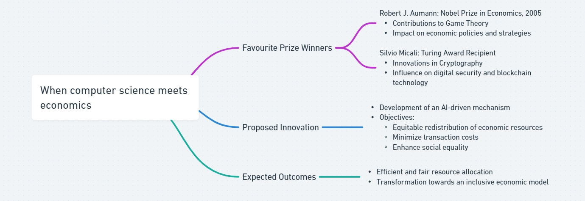
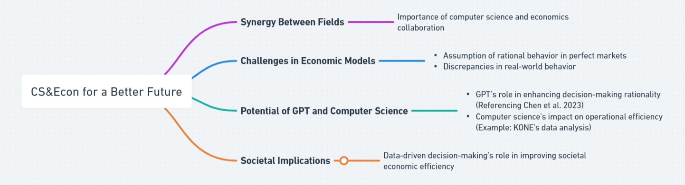
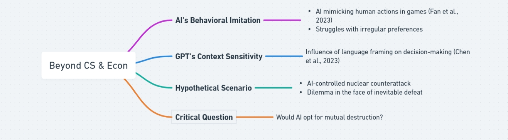

# Reflection 1

### Question 1 
**When computer science meets economics**: Who do you truly want to become? Pick one of your favorite Nobel Prize winners (https://www.nobelprize.org/) and Turing Award winners (https://amturing.acm.org/). How do you want to contribute to the intersection of the two north stars to advance human civilizations? 

### Question 2
**CS&Econ for a Better Future**: How do you perceive the synergy between computer science and economics as a catalyst for steering innovation toward a brighter future? Please present a foundational assertion, followed by multiple specific instances that support your claim, including a reference to a topic discussed at the colloquium on Friday, March 22.

### Question 3
**Beyond CS & Econ**: How are aspects of human nature, like bounded rationality, and pioneering technologies, such as generative AI, reshaping the dynamics between humans and AI agents in strategic contexts? Additionally, how might this interplay be perceived and conceptualized distinctively from current models? Address this inquiry by drawing upon the literature covered in our lectures and supplementary scholarly works, ensuring to include in-text citations and a comprehensive bibliography.

# Answer 

### Question 1
I admire Robert J. Aumann, the 2005 Nobel Prize laureate, for his groundbreaking contributions to Game Theory. His work provides profound insights into decision-making processes and interactions among individuals and organizations over time. Aumann's research has been instrumental in developing more effective economic policies and strategies by elucidating the dynamics of cooperation and competition. This has had a significant impact on economic modeling and analysis.

In the realm of the Turing Award, Silvio Micali stands out for his transformative work in cryptography. His innovations in public-key cryptosystems, digital signatures, and protocols have greatly enhanced digital transaction security and laid the groundwork for modern cryptography. Micali's work has been crucial in advancing blockchain technology and cryptocurrencies, thereby reshaping the digital economy and fintech innovations.

Inspired by such pioneers, I aim to create a novel mechanism leveraging AI to redistribute economic resources equitably. This system, powered by advanced algorithms and data analytics, seeks to minimize transaction costs while promoting social equality. The goal is to make resource allocation more efficient and fair, pushing the economic distribution paradigm towards a more inclusive and balanced model.

### Question 2
I firmly believe that the synergy between computer science and economics is pivotal in driving innovation forward. Traditional economic models often assume a perfect market where individuals act rationally. However, real-world observations frequently contradict this, making the practical application of economic theories and policies challenging. According to Chen et al. (2023), GPT technologies hold promise in augmenting human decision-making by introducing a level of rationality often absent in human actors. Moreover, a lecture on March 22 highlighted KONE's utilization of computer science to enhance operational efficiency through data analysis. Extending these principles to a societal level, it becomes evident that computer science, with its superior data processing capabilities, can significantly boost economic efficiency by grounding decisions in factual data analysis.

### Question 3
Fan et al. (2023) found that while AI can mimic human actions in certain games, it struggles with atypical preferences. Similarly, Chen et al. (2023) noted that GPT's response can vary significantly with the context, influenced by the linguistic framing of choices. This raises a critical question: in a scenario where an AI-controlled nuclear counterattack system faces inevitable defeat, would it opt for a mutual destruction strategy by launching all available nuclear weapons?

## Bibliography
Chen, Yiting, Tracy Xiao Liu, You Shan, and Songfa Zhong. 2023. “The Emergence of Economic Rationality of GPT.” Proceedings of the National Academy of Sciences of the United States of America 120 (51). https://doi.org/10.1073/pnas.2316205120.

Fan, Caoyun, Jindou Chen, Yaohui Jin, and Hao He. 2023. “Can Large Language Models Serve as Rational Players in Game Theory? A Systematic Analysis.” ArXiv.org. December 12, 2023. https://doi.org/10.48550/arXiv.2312.05488.

“Silvio Micali - A.M. Turing Award Laureate.” n.d. Amturing.acm.org. Accessed March 24, 2024. https://amturing.acm.org/award_winners/micali_9954407.cfm.

“The Sveriges Riksbank Prize in Economic Sciences in Memory of Alfred Nobel 2005.” n.d. NobelPrize.org. Accessed March 24, 2024. https://www.nobelprize.org/prizes/economic-sciences/2005/summary/.
